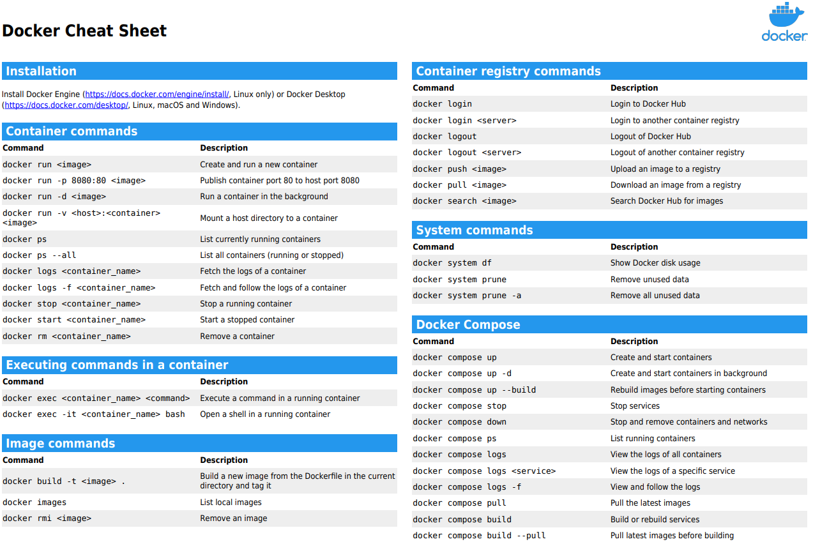
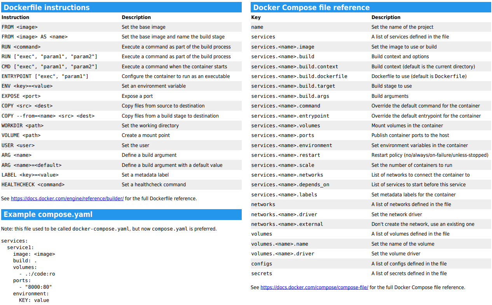

# Docker Notes 🐳

1. [Traditional Approach: Virtual Machines (Old Solution)](#traditional-approach-virtual-machines-old-solution)
2. [Docker Solution: Containers (New Solution)](#docker-solution-containers-new-solution)
3. [Key Docker Concepts](#key-docker-concepts)
4. [Dockerfile Breakdown](#dockerfile-breakdown)
5. [Common Docker Commands](#common-docker-commands)
6. [Docker Compose](#docker-compose)
7. [Docker Image Optimisation](#docker-image-optimisation)
8. [Docker Networking](#docker-networking)
9. [Docker Registry](#docker-registry)
10. [Docker Workflow](#docker-workflow)
11. [Scaling Containers](#scaling-containers)

## Traditional Approach: Virtual Machines (Old Solution)

- **Baseline**: Hardware (CPU, RAM, Disk) + OS
  - **Virtual Machine (VM)**:
    - Each VM runs its own OS and dependencies, leading to heavy resource consumption (CPU + RAM + Disk).
    - VMs often introduce performance bottlenecks due to the overhead of hypervisors and individual OS for each VM.

### Application Stack on VMs

- **Web Server**: Nginx
- **Database**: MongoDB
- **Messaging Queue**: Redis
- **Orchestration**: Ansible

**Problem**: Compatibility issues across hardware, OS, libraries, and dependencies, leading to the notorious "matrix nightmare."

- Common scenario: "It works on my machine!" but fails in production.

## Docker Solution: Containers (New Solution)

- **Baseline**: Hardware (CPU, RAM, Disk) + OS
  - **Docker Engine**:
    - Instead of virtualising the hardware like VMs, Docker virtualises the host OS, allowing containers to share the same OS kernel while running in isolated environments.
    - This makes containers faster, more lightweight, and efficient compared to VMs.

## Key Docker Concepts

1. **Dockerfile**: A blueprint for building the Docker image.
2. **Docker Image**: A template for running the docker container; includes everything needed to run an application (e.g., OS, dependencies, app code).
3. **Container**: A running instance of the application.

## Dockerfile Breakdown

A **Dockerfile** describes the steps to build a container. Here's a breakdown of common instructions:

1. **FROM**: Specifies the base image (e.g., `FROM python:3.9-alpine`).
2. **WORKDIR**: Sets the working directory inside the container.
3. **COPY**: Copies files from the host machine into the container (e.g., `COPY requirements.txt .`).
4. **RUN**: Executes commands inside the container (e.g., installing dependencies).
5. **EXPOSE**: Exposes a port inside the container (note: this port is not automatically accessible externally).
6. **ENV**: Sets environment variables.
7. **CMD**: Defines the default command to run when the container starts (e.g., `CMD ["python", "app.py"]`).

## Common Docker Commands

- **Build an image**:
  ```bash
  docker build -t <image_name> <path_to_Dockerfile>
  ```
- **Run a container with port mapping**:
  ```bash
  docker run -p 8080:5000 <container_name>
  ```
  HOST:CONTAINER - Maps port 5000 inside the container to port 8080 on the host.
- **Volume mapping** (for persistent data storage):
  ```bash
  docker run -v /opt/datadir:/var/lib/mysql mysql
  ```
- **Push an image to Docker Hub**:

  ```bash
  docker push <image_name>
  ```

- **Pull an image from Docker Hub**:
  ```bash
  docker pull <image_name>
  ```



Source: Nic Wortel

## Docker Compose

**Docker Compose** allows defining and running multi-container applications using a YAML file. It simplifies orchestrating applications that consist of multiple services (e.g., web server, database, caching).

**Key Benefits**:

- Start all services with a single command: `docker-compose up`.
- Define networks, volumes, and dependencies between services.
- Scale services easily with `docker-compose up --scale <service>=N`.

**Example**:

```yaml
version: "3.8"

services:
  web:
    image: nginx:alpine
    ports:
      - "80:80"
    volumes:
      - ./nginx.conf:/etc/nginx/nginx.conf
    depends_on:
      - app

  app:
    build: ./app
    volumes:
      - ./app:/app
    ports:
      - "5000:5000"
    environment:
      - DATABASE_URL=mysql://root:password@db/mydb
    depends_on:
      - db

  db:
    image: mysql:5.7
    environment:
      MYSQL_ROOT_PASSWORD: password
      MYSQL_DATABASE: mydb
    volumes:
      - db_data:/var/lib/mysql

volumes:
  db_data:
```

This docker-compose.yml file defines a multi-container application stack consisting of three services: a database (MySQL), an application (backend), and a web server (Nginx). Each service is configured to run in its own container, and they are linked to ensure proper communication.

The `depends_on` is used to define the order in which services are started. However, it does not wait for a service to be "ready" (i.e., fully operational), but only ensures that the dependent service has been started:

- `app` depends on `db`
- `web` depends on `app`

## Docker Image Optimisation

1. **Use a Smaller Base Image**:

   - Instead of using full OS images (e.g., `ubuntu`), **Alpine** (`alpine:latest`) is a lightweight alternative.
   - For Python applications: `python:3.9-alpine`.

2. **Multi-Stage Builds**:

   - Separate build and runtime stages to create smaller final images.
   - Example:

     ```Dockerfile
     # Stage 1: Build
     FROM python:3.9-slim AS builder
     WORKDIR /app
     COPY requirements.txt .
     RUN pip install --no-cache-dir -r requirements.txt
     COPY . .

     # Stage 2: Runtime
     FROM python:3.9-alpine
     WORKDIR /app
     COPY --from=builder /app /app
     EXPOSE 8080
     CMD ["python", "app.py"]
     ```

3. **Minimise Layers**:

   - Combine multiple `RUN` instructions into a single line to reduce layers and image size:
     ```Dockerfile
     RUN apt-get update && apt-get install -y package && rm -rf /var/lib/apt/lists/*
     ```

4. **Use `.dockerignore`**:

   - Avoid copying unnecessary files into the image (similar to `.gitignore`).

5. **Remove Unused Dependencies**:

   - Uninstall build dependencies after they are no longer needed:
     ```Dockerfile
     RUN apt-get remove --purge -y build-essential
     ```

6. **Use Slim Versions of Images**:
   - Use official "slim" versions of images when possible (e.g., `python:3.9-slim`).

## Docker Networking

**Docker provides several networking modes depending on the use case**:

1. **Bridge Network** (default for standalone containers):

   - Containers on the same bridge network can communicate via IP or container names.
   - Example:
     ```bash
     docker network create my-bridge-network
     docker run -d --name container1 --network my-bridge-network nginx
     ```

2. **Host Network**:

   - The container shares the host's network stack directly.
   - Example:
     ```bash
     docker run --network host nginx
     ```

3. **None Network**:

   - The container has no network interface.
   - Example:
     ```bash
     docker run --network none nginx
     ```

4. **Overlay Network** (for multi-host setups, e.g., Docker Swarm):

   - Example:
     ```bash
     docker network create --driver overlay my-overlay-network
     ```

5. **Macvlan Network** (legacy apps needing unique MAC addresses):
   - Example:
     ```bash
     docker network create -d macvlan --subnet=192.168.1.0/24 --gateway=192.168.1.1 -o parent=eth0 my-macvlan-network
     ```

### Summary

- **Bridge Network**: Default, container-to-container communication on the same host.
- **Host Network**: Directly shares the host's network (for performance reasons).
- **None Network**: No networking, fully isolated.
- **Overlay Network**: Enables multi-host communication (for Docker Swarm or Kubernetes).
- **Macvlan Network**: Assigns containers their own MAC addresses.

## Docker Registry

A **Docker Registry** is a storage and distribution hub for Docker images. It allows you to store custom Docker images, making them available for download and use in different environments (local, staging, production).

### Key Concepts

1. **Docker Hub**: The default and public Docker registry provided by Docker. It hosts a vast collection of official and community-contributed images. When you use `docker pull <image_name>`, [Docker Hub](https://hub.docker.com/) is the default source.

2. **Private Registry**: this is useful for enterprise or internal use cases when you don’t want to store images publicly.

3. **Self-hosted Registries**: this lets you store images privately using the `registry` Docker image from Docker Hub.

### Common Commands

**Login to a Docker Registry**:

```
docker login
```

**Push an Image to Docker Hub**:

```
docker tag <image_id> <dockerhub_username>/<image_name>:<tag>
```

```
docker push <dockerhub_username>/<image_name>:<tag>
```

**Pull an Image from Docker Hub**:

```
docker pull <image_name>:<tag>
```

**Run a Private Registry** (locally or on a server):

```
docker run -d -p 5000:5000 --name registry registry:2
```

**Push an Image to a Private Registry**:

```
docker tag <image_id> localhost:5000/<image_name>
```

```
docker push localhost:5000/<image_name>
```

**Pull an Image from a Private Registry**:

```
docker pull localhost:5000/<image_name>
```

## Docker Workflow

1. **Push Image**: Upload your container image to a registry (e.g., Docker Hub).
2. **Pull Image**: Download the container image from the registry.
3. **Run Image**: Start a container based on the image.

## Scaling Containers:

- Use **Kubernetes** as an orchestration tool to scale and manage multiple containers.
