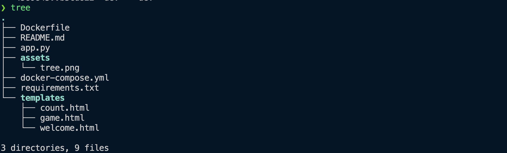

# Flask Redis Guess Number Game

This is a simple web-based guessing game built using Flask and Redis. The user is asked to guess a number between 1 and 10. Redis is used for storing the visit count and the correct number for the game.

## Project Structure



## Setup

To run the application, you'll need Docker Desktop and Docker Compose installed.

### Clone the Repository

```bash
git clone https://github.com/sohailsajid79/coderco-devops.git
cd coderco-devops/Docker/flask-redis-guess-number-game
```

### Build and Run the Application

```bash
docker compose build
```

```bash
docker compose up
```

This will start two containers:

Flask app on port `5002`
Redis on port `6379`
Visit the Flask app in your browser at http://localhost:5002.

### Stop the Application

```bash
docker compose down
```

### To-Do:

- Persistent Storage for Redis: Configure Redis to use a volume to persist its data.
- Environment Variables: Modify the Flask application to read Redis connection details from environment variables and update the docker-compose.yml accordingly.
- Scaling the Application: Scale the Flask service to run multiple instances and load balance between them using Docker Compose.
