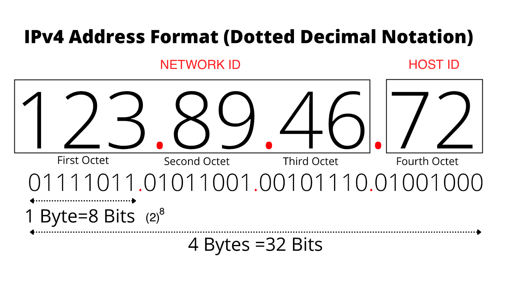
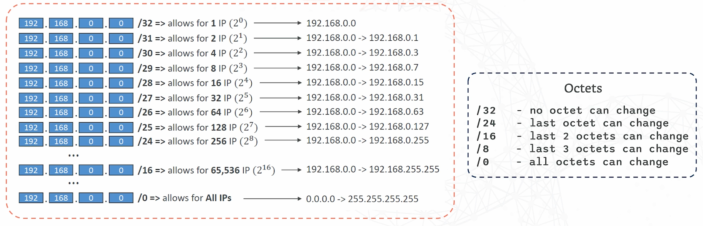

# Networking Fundamentals

1. [OSI Model Overview](#osi-model-overview)

   - [Application](#application)
   - [Presentation](#presentation)
   - [Session](#session)
   - [Transport](#transport)
   - [Network](#network)
     - [IP Addressing](#ip-addressing)
     - [Subnetting](#subnetting)
     - [NAT](#nat)
   - [Data Link](#data-link)
   - [Physical](#physical)

2. [TCP/IP Model](#tcpip-model)
3. [DNS](#dns)
   - [DNS Resolution Process](#dns-resolution-process)
   - [Common DNS Records](#common-dns-records)
   - [DNS Troubleshooting Tools](#dns-troubleshooting-tools)
4. [Common Ports](#common-ports)

## OSI Model Overview

### Application

The Application Layer is the top layer of the OSI model. It interacts directly with end-user applications and provides the interface for users to communicate with the network. This layer handles network services that end-users interact with, such as web browsing, file transfers, and email.

- **Protocols**: HTTP/HTTPS, SSH, DNS

### Presentation

Responsible for data translation and syntax, ensuring the format and structure of the data are standardised, so it can be understood across different systems.

For example, converting ASCII to UTF-8 or preparing data for encryption or compression. Syntax on the other hand ensures that the data being transmitted follows the agreed-upon rules for representation, such as encoding formats or data types; **JSON**, **XML** or **YAML**.

The presentation layer also handles data encryption and decryption, like SSL/TLS, for secure communication between the client and server.

- **Protocols**: SSL/TLS, SSH, IMAP, FTP

### Session

**Responsible for establishing, managing, and terminating sessions between two communicating systems**. For example, it manages authentication flows like **OAuth**, which defines the steps an application follows to verify a user's identity (authentication). The flow determines how tokens are issued, exchanged, and used to securely authenticate users without directly sharing sensitive credentials, such as passwords.

### Transport

Handles end-to-end communication and is responsible for the delivery of data packets and ensuring that data is sent and received correctly across a network.

- **Protocols**:

  - TCP

    - Before any data is transmitted, TCP establishes a connection between the sender and receiver using a **three-way handshake** (SYN, SYN-ACK, ACK).
    - **End-to-end reliability**: TCP ensures that all data packets are received in the correct order and without errors. If packets are lost, TCP handles re-transmission.
    - **Error-checking and flow control**: TCP ensures the integrity of data through error-checking mechanisms like checksums, and it manages the rate at which data is sent to avoid overwhelming the receiver.
    - **Use case**: We use TCP when accuracy and complete data transfer are crucial, such as web browsing (HTTP/HTTPS), file transfers (FTP), and email (SMTP).

  - **UDP**
    - Unreliable, connectionless protocol and unlike TCP, UDP does not establish a connection before sending data. It simply sends data as packets, called datagrams, without checking whether they are received correctly.
    - **Fast but less reliable**: Since there is no connection setup or error-checking, UDP is much faster than TCP. However, there's no guarantee that all packets will arrive, or that they will arrive in order.
    - **Use case**: We use UDP when speed is more important than reliability. It’s often used for real-time applications such as live streaming, online gaming, and voice/video calls, where small amounts of data loss are acceptable.

### Network

**Deals with logical addressing and routing traffic between different networks using IP addresses**.\*

**Routers** - Commonly referred to as the **default gateway**, routers route traffic between networks based on IP addresses. For example, a router connects your home network (LAN) to the internet (WAN) and can optionally connect via WiFi or Ethernet cable.

**Switches** - On the other hand, switches provide connectivity within a Local Area Network (LAN). They forward traffic from one port to another based on MAC addresses.

#### IP Addressing

IP addresses provide unique identifiers for devices on a network. There are two types of IP addressing: **IPv4** and **IPv6**.

**IPv4**: Consists of four 8-bit groups (octets) for a total of 32 bits, for example, `123.89.46.72`.



**IPv6**: Uses 128 bits in total, divided into eight groups of 4 hexadecimal digits, for example, `2001:0db8:85a3:0000:0000:8a2e:0370:7334`.

- **Compressed Version**: `2001:db8:85a3::8a2e:370:7334`

##### IP Classes

IP addresses are divided into classes based on the size of the network. These classes help manage IP address allocation efficiently.

| **Class** | **Range**                   | **Default Subnet Mask**   |
| --------- | --------------------------- | ------------------------- |
| **A**     | 1.0.0.0 - 126.255.255.255   | 255.0.0.0                 |
| **B**     | 128.0.0.0 - 191.255.255.255 | 255.255.0.0               |
| **C**     | 192.0.0.0 - 223.255.255.255 | 255.255.255.0             |
| **D**     | 224.0.0.0 - 239.255.255.255 | (Multicast)               |
| **E**     | 240.0.0.0 - 255.255.255.255 | (Reserved for future use) |

##### Private IP Address Ranges (RFC1918)

These ranges are reserved for private networks and are not routable on the public internet.

| IP Range                      | CIDR Notation  | Total IP Addresses   |
| ----------------------------- | -------------- | -------------------- |
| 10.0.0.0 – 10.255.255.255     | 10.0.0.0/8     | 16,777,216 addresses |
| 172.16.0.0 – 172.31.255.255   | 172.16.0.0/12  | 1,048,576 addresses  |
| 192.168.0.0 – 192.168.255.255 | 192.168.0.0/16 | 65,536 addresses     |

##### Public vs. Private IP Address Ranges

| Class | Range                     | Default Subnet Mask | Private IP Range              | Public IP Range                                          | Special Use Case               |
| ----- | ------------------------- | ------------------- | ----------------------------- | -------------------------------------------------------- | ------------------------------ |
| A     | 1.0.0.0 - 126.255.255.255 | 255.0.0.0           | 10.0.0.0 - 10.255.255.255     | 1.0.0.0 - 9.255.255.255, 11.0.0.0 - 126.255.255.255      | `127.0.0.1` (Loopback Address) |
| B     | 128.0.0.0 - 191.255.0.0   | 255.255.0.0         | 172.16.0.0 - 172.31.255.255   | 128.0.0.0 - 172.15.255.255, 172.32.0.0 - 191.255.255.255 |                                |
| C     | 192.0.0.0 - 223.255.255.0 | 255.255.255.0       | 192.168.0.0 - 192.168.255.255 | 192.0.0.0 - 192.167.255.255, 192.169.0.0 - 223.255.255.0 |                                |

##### Binary to Decimal Conversion Example

Given the IP address: **11000000.10101000.00000001.00010101**  
This translates to **192.168.1.21** in decimal.

| Octet | Binary Value | Decimal Value |
| ----- | ------------ | ------------- |
| 1st   | 11000000     | 192           |
| 2nd   | 10101000     | 168           |
| 3rd   | 00000001     | 1             |
| 4th   | 00010101     | 21            |

##### Decimal to Binary Conversion Example

To convert **192.168.1.21** to binary:

| Decimal Octet | Binary Value |
| ------------- | ------------ |
| 192           | 11000000     |
| 168           | 10101000     |
| 1             | 00000001     |
| 21            | 00010101     |


Source: Sunny Classroom - YouTube

This is a subnetting table that helps simplify the process of calculating subnets, hosts, and subnet masks in IP addressing. It is often used to break down IP networks into smaller sub-networks (subnets) for efficient IP address management.

#### Subnetting

Subnetting divides a large network into smaller sub-networks (subnets) to helps manage IP address allocation more efficiently and controls network traffic.

- **Cake**: The large network is like a big birthday cake.
- **Cutting the Cake**: Subnetting is like slicing the cake into smaller pieces so that each guest (device) gets a portion (IP address).
- **Slices**: Each subnet is a slice of the cake, where the size of the slice is determined by how many devices need to be in that subnet.
- **Efficient Distribution**: Subnetting prevents overcrowding of some network parts and underutilization of others.
- **Traffic Control**: By organizing the cake into slices, you ensure that each device stays within its own subnet, preventing network congestion.

##### Subnet Mask and CIDR

For example, the IP address `192.168.1.0` with a default subnet mask `255.255.255.0`:

- The first three octets (`255.255.255`) represent the network part, and the last octet (`0`) represents the host part. The CIDR notation for this would be `192.168.1.0/24`.

- The /24 subnet mask in binary is:
  `11111111.11111111.11111111.00000000` — The first 24 bits represent the network, while the remaining 8 bits are for hosts.

Here’s how subnet masks allow for varying IP ranges:


Source: CoderCo

This table provides a visual breakdown of how the subnet mask impacts the number of available subnets and hosts in each network.

#### NAT

NAT (Network Address Translation) operates at Layer 3 as well, since it involves IP address manipulation to route traffic between a local network (with private IPs) and the internet (with public IPs).

- **Private IPs**: Devices within a local network (e.g. 192.168.1.x) use private IP addresses that are not routable on the internet.
- **Public IP**: When these devices access the internet, the router uses NAT to translate the private IP address into a single public IP address.
- **Traffic Translation**: The router keeps track of which internal devices requested what external resources, ensuring that responses from the internet are sent back to the correct device.

Types of NAT:

- **Static NAT**: Maps one private IP to one public IP.
- **Dynamic NAT**: Maps multiple private IPs to a pool of public IPs.
- **PAT (Port Address Translation)**: A form of NAT that maps multiple private IPs to a single public IP, using different ports.

### Data Link

**Responsible for node-to-node data transfer.** It provides error detection and handling, as well as managing how data is framed for transmission.

- **Functions**: MAC addressing, error detection, frame sequencing
- **Devices**: Switches
- **Protocols**: Ethernet, Wi-Fi (802.11)

### Physical

Responsible for the physical transmission of data over network mediums: electrical | optical | radio signals

Components of the Physical Layer:

- **Fiber**: Transmits data as light pulses through fiber-optic cables.
- **Wireless**: Transmits data as radio waves (e.g. Wi-Fi, Bluetooth).
- **Hubs**: Basic network devices that broadcast data to all devices in a local network without filtering or routing.
- **Repeaters**: Amplify or regenerate signals to extend the transmission distance over a network medium, ensuring that the signal remains strong over long distances.

## TCP/IP Model

The **TCP/IP Model** (Transmission Control Protocol/Internet Protocol) is the fundamental communication protocol suite used for transmitting data over the internet. It is often compared to the OSI model, but it consists of four layers instead of seven. The TCP/IP model focuses more on standard protocols used for network communications.

### Application

The **Application Layer** in the TCP/IP model corresponds to the upper three layers of the OSI model (Application, Presentation, and Session). It provides high-level protocols and services that network applications use to communicate over the network.

- **Functions**: Handles high-level protocols for communication, such as web browsing, email, and file transfers.
- **Protocols**: HTTP/HTTPS, FTP, SMTP, DNS

### Transport

The **Transport Layer** ensures reliable or unreliable delivery of data between two devices. It corresponds to the Transport Layer in the OSI model and supports both connection-oriented and connectionless communication.

- **Protocols**:
  - **TCP** (Transmission Control Protocol): Reliable, connection-oriented protocol that guarantees data delivery.
  - **UDP** (User Datagram Protocol): Fast, connectionless protocol used for applications where speed is prioritized over reliability.

### Internet

The **Internet Layer** is responsible for addressing, routing, and packaging data for transmission. It corresponds to the OSI Network Layer and uses IP addresses to route packets between networks.

- **Functions**: Logical addressing, routing of packets across networks
  Protocols:
- **Protocols**: IP, ICMP; `ping` `tracert` (Windows) `traceroute` (Linux/Mac)

### Network Access

The **Network Access Layer** corresponds to the OSI model's Data Link and Physical Layers. It handles the physical transmission of data and how bits are converted into signals to transmit across the network medium.

- **Functions**: Managing how data is sent over physical media, such as cables or wireless signals
- **Protocols**: Ethernet, Wi-Fi (802.11)

## DNS

DNS translates human-readable domain names (e.g. google.com) to IP address (e.g. 8.8.8.8), which enables devices to find and connect to websites and services on the internet.

### DNS Resolution Process

1. User enters a URL (e.g. [www.footballfantasy.com](https://fantasy.premierleague.com/)).
   The DNS resolver **checks the local cache**. If no cached record exists:
2. The DNS resolver queries a **Root Nameserver**, which directs the request to the appropriate TLD (Top-Level Domain) Nameserver (e.g. .com).
3. The **TLD Nameserver** directs the request to the Authoritative Nameserver, which contains the domain’s DNS records.
4. The **Authoritative Nameserver** returns the IP address associated with the domain.
5. The DNS resolver caches the IP address for future use.

### Common DNS Records

- `A`: Maps a domain to an IPv4 address.
- `AAAA`: Maps a domain to an IPv6 address.
- `CNAME`: Alias record that points one domain to another (e.g. www.footballfantasy.com to footballfantasy.com).
- `MX`: Specifies the mail server responsible for receiving emails for the domain.
- `TXT`: Allows administrators to insert text, commonly used for domain verification and other configurations.

### DNS Troubleshooting Tools

- `dig`: query DNS name servers and display DNS records:

```
dig ns footballfantasy.com
```

```
dig +short ns footballfantasy.com
```

- `nslookup`: query DNS records and resolving hostnames to IP addresses:

```
nslookup footballfantasy.com
```

- `ping`: sends requests to domain name/ IP address to check network connectivity and response time.

```
ping footballfantasy.com
```

- `/etc/hosts file`: contains local mappings between hostnames and IP addresses for quick lookup.

- `ipconfig` (Windows): displays network configurations

- `ipconfig /flushdns`: if experiencing problems with websites not loading, or if DNS records have changed we can clear the cache to get fresh DNS information.

- `ipconfig /release`: when we need to drop the current network configuration to force a new IP address lease from the DHCP server.

- `ipconfig /renew`: after releasing the IP address with ipconfig /release, we need to renew the request for a new IP address from the DHCP server.

## Common Ports

| Port Number | Protocol   | Description                                                 |
| ----------- | ---------- | ----------------------------------------------------------- |
| 20          | FTP        | File Transfer Protocol (data transfer)                      |
| 21          | FTP        | File Transfer Protocol (command/control)                    |
| 22          | SSH        | Secure Shell (secure remote login)                          |
| 23          | Telnet     | Unencrypted remote login                                    |
| 25          | SMTP       | Simple Mail Transfer Protocol (email sending)               |
| 53          | DNS        | Domain Name System (name resolution)                        |
| 67/68       | DHCP       | Dynamic Host Configuration Protocol (IP address assignment) |
| 80          | HTTP       | Hypertext Transfer Protocol (web browsing)                  |
| 110         | POP3       | Post Office Protocol (retrieving email)                     |
| 143         | IMAP       | Internet Message Access Protocol (retrieving email)         |
| 443         | HTTPS      | Hypertext Transfer Protocol Secure (secure web browsing)    |
| 445         | SMB        | Server Message Block (file sharing in Windows)              |
| 3389        | RDP        | Remote Desktop Protocol (remote desktop)                    |
| 389         | LDAP       | Lightweight Directory Access Protocol (directory services)  |
| 636         | LDAPS      | Secure LDAP (encrypted directory services)                  |
| 137-139     | NetBIOS    | NetBIOS services over TCP/IP (older file sharing)           |
| 161/162     | SNMP       | Simple Network Management Protocol (network management)     |
| 69          | TFTP       | Trivial File Transfer Protocol (simple, no authentication)  |
| 2049        | NFS        | Network File System (file sharing in Unix/Linux)            |
| 3306        | MySQL      | MySQL database server                                       |
| 5432        | PostgreSQL | PostgreSQL database server                                  |
| 8080        | HTTP       | Alternative HTTP port (used for testing/development)        |
| 5900        | VNC        | Virtual Network Computing (remote desktop sharing)          |
