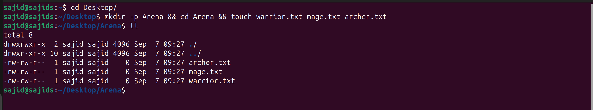

```
mkdir -p Arena && cd Arena && touch warrior.txt mage.txt archer.txt
```

```
ll
```



### Aliases

The `mkdir -p` option ensures that no error is thrown if the directory already exists.

The `ll` command is a shorthand for `ls -alF` (Ubuntu, Linux), which lists files and directories in long format, including hidden files and appending symbols to indicate file types.
