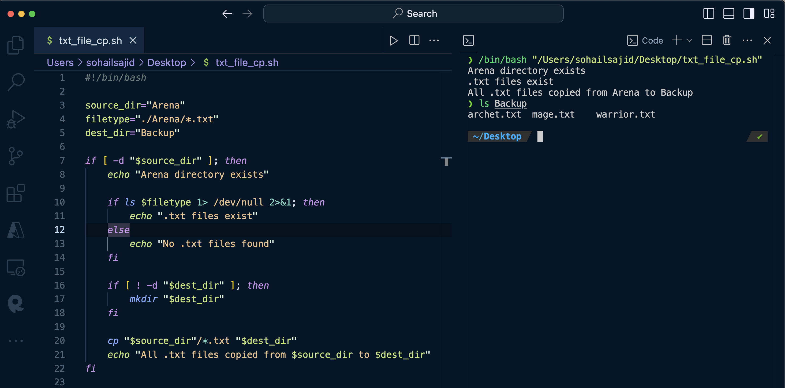

### Complete Solution

The solution checks if the Arena directory exists on our Desktop. If it does, we use a wildcard expression to check if any .txt files are present therein. We then check if a directory named Backup exists; if not, we create it. Finally, we proceed to copy the .txt files from the Arena directory to the Backup directory.
